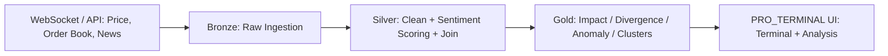

# PRD — PRO_TERMINAL: Narrative-Driven Crypto Intelligence Terminal

<aside>
🎯

**Thesis anti-mainstream:** Pasar sudah penuh dengan "crypto dashboard" + "AI price predictor". Edge-nya kecil dan gampang ditiru. PRO_TERMINAL tidak menjual *prediksi harga*, tapi menjual **penjelasan kenapa harga bergerak** — menghubungkan *narasi berita → sentimen → mikrostruktur order book → reaksi harga* secara real-time, di atas pipeline data **Medallion (Bronze/Silver/Gold)**.

</aside>

## 1. Ringkasan Eksekutif

PRO_TERMINAL adalah *market intelligence terminal* untuk BTC/USDT yang fokus pada **kausalitas & explainability**, bukan sekadar ramalan. Versi sekarang sudah punya: live price, order book, market news stream ber-sentimen, panel *System Anomalies*, LSTM prediction, dan *Price vs Sentiment Correlation (Gold Layer)*.

Dokumen ini mengusulkan lapisan **visualisasi & fitur anti-mainstream** agar produk punya sudut pandang unik yang sulit ditiru, sekaligus jadi *showcase* arsitektur data Medallion.

## 2. Masalah & Peluang

**Yang mainstream (jenuh):**

- Chart candlestick + indikator standar (RSI, MACD).
- "AI prediksi harga besok" dengan satu angka tunggal.
- Fear & Greed Index generik.
- Order book list angka mentah.

**Peluang yang underexplored:**

- Visualisasi *kausal*: berita mana yang benar-benar menggerakkan harga.
- Sinyal *divergensi* sentimen vs harga (kontrarian).
- *Liquidity heatmap* & deteksi spoofing dari order book.
- *Narrative clustering* dari aliran berita real-time.

## 3. Positioning Anti-Mainstream

> **"Bukan terminal yang menebak harga, tapi terminal yang menjelaskan pasar."**
> 

Diferensiasi inti = **explainability + event-study + microstructure**, semua disusun sebagai *Gold Layer features* yang transparan dan bisa ditelusuri balik ke data mentah (auditable).

## 4. Tujuan & Non-Tujuan

| ✅ Tujuan | 🚫 Non-Tujuan |
| --- | --- |
| Menjelaskan *kenapa* harga bergerak via narasi + sentimen + order flow | Memberi sinyal beli/jual sebagai *financial advice* |
| Visualisasi anti-mainstream yang explainable & auditable | Menjanjikan akurasi prediksi tinggi sebagai jualan utama |
| Showcase pipeline Medallion (Bronze→Silver→Gold) | Eksekusi order / jadi exchange / wallet |

## 5. Target Pengguna

- **Analis data / mahasiswa data** — ingin studi kasus real-time ber-arsitektur jelas.
- **Trader naratif (event-driven)** — peduli berita & likuiditas, bukan cuma chart.
- **Reviewer / dosen / portofolio** — menilai kedalaman engineering & insight.

## 6. Fitur Unggulan (Anti-Mainstream)

| Fitur | Apa yang beda | Insight / Edge |
| --- | --- | --- |
| 📰 **News Impact Timeline** | Marker berita ditempel di price chart + jendela reaksi harga (Δ% dalam N menit) | Tahu berita mana yang *benar-benar* menggerakkan pasar, bukan asumsi |
| ⚖️ **Sentiment–Price Divergence Gauge** | Diverging area chart saat sentimen ↔ harga berlawanan arah | Sinyal kontrarian: pasar "panik tapi harga bertahan" |
| 🔥 **Order Book Liquidity Heatmap** | Heatmap likuiditas 2D antar waktu (ala Bookmap), bukan list angka | Deteksi liquidity wall & dugaan spoofing |
| 📡 **Whale & Anomaly Radar** | Upgrade panel *System Anomalies* jadi feed real-time + skor severity (z-score) | Order jumbo / lonjakan volume tersorot otomatis |
| 🧩 **Narrative Topic Map** | Clustering berita ke tema (geopolitik, regulasi, makro, adopsi) → treemap net-sentimen | Tahu *narasi dominan* yang menyetir pasar hari ini |
| 🌐 **Cross-Asset Correlation Web** | Matriks/network korelasi BTC vs minyak, emas, DXY, equities | Konteks makro (mis. berita minyak Iran → BTC) |
| 📈 **Probabilistic Prediction Fan** | Ganti 1 angka LSTM jadi *quantile fan chart* ber-confidence | Lebih jujur soal ketidakpastian — anti-overclaim |
| ⏪ **Replay / What-If Mode** | Putar ulang window historis untuk lihat berita→sentimen→harga | Storytelling & validasi naratif (event study) |

## 7. Spesifikasi Visualisasi (Detail)

- 📰 News Impact Timeline (fitur sinyatur)
    - **Input:** stream berita ber-sentimen + price series (timestamp aligned).
    - **Logika:** untuk tiap berita, hitung Δ harga pada window +1m/+5m/+15m sesudah publikasi → klasifikasi *Mover / Noise*.
    - **Visual:** marker di atas price chart (warna = polaritas sentimen, ukuran = |Δ harga|). Hover → kartu berita + reaksi harga.
    - **Anti-mainstream-nya:** menjawab "berita ini ngaruh nggak?" secara empiris, bukan narasi kosong.
- ⚖️ Sentiment–Price Divergence Gauge
    - **Input:** rolling sentiment score (dari news stream) vs rolling price return.
    - **Logika:** hitung divergence = z(sentimen) − z(return). |divergence| tinggi = peringatan kontrarian.
    - **Visual:** diverging area chart + gauge "Divergence Level" (Aligned / Watch / Contrarian).
- 🔥 Order Book Liquidity Heatmap
    - **Input:** snapshot order book berkala (Bronze) → grid (harga × waktu).
    - **Visual:** heatmap intensitas likuiditas; garis harga di atasnya. Highlight bid/ask imbalance.
    - **Bonus:** deteksi *spoofing* = wall likuiditas yang muncul/hilang cepat tanpa eksekusi.
- 📡 Whale & Anomaly Radar
    - **Input:** order size, volume, price jump.
    - **Logika:** rolling z-score / IQR → severity (Low/Med/High). Saat ini panel menampilkan "No anomalies detected" — ubah jadi feed bertimestamp.
    - **Visual:** feed kronologis + radar/scatter (sumbu: ukuran vs deviasi harga).
- 🧩 Narrative Topic Map
    - **Input:** judul + body berita.
    - **Logika:** embedding + clustering tema; agregasi net sentimen per tema.
    - **Visual:** treemap/bubble (ukuran = volume berita, warna = net sentimen).

## 8. Arsitektur Data (Medallion)

<aside>
🏗️

Label "Gold Layer" yang sudah ada di tab Analysis dipertahankan — semua fitur baru = **Gold features** yang bisa ditelusuri balik ke Bronze (auditable).

</aside>

| Layer | Isi | Contoh |
| --- | --- | --- |
| 🟫 **Bronze (raw)** | Data mentah hasil ingestion websocket/API | Price ticks, order book snapshots, raw news articles |
| ⬜ **Silver (cleaned)** | Bersih, ter-normalisasi, ter-dedup, ter-enrich | Berita ber-skor sentimen, harga ter-resample, join by timestamp |
| 🟨 **Gold (curated)** | Fitur & agregasi siap-pakai untuk visual | News impact, divergence, anomaly score, narrative clusters, prediction fan |

## 9. Tech Stack (Usulan)

- **Ingestion:** Binance WebSocket (price + order book), News API / RSS.
- **Processing:** Python (pandas, scikit-learn untuk z-score/clustering), sentiment model (FinBERT / VADER), LSTM (PyTorch/TF).
- **Storage:** layer Medallion (Parquet/DuckDB atau warehouse).
- **Frontend:** React + lightweight-charts / D3 / Plotly untuk heatmap & fan chart.

## 10. Metrik Keberhasilan

- % berita yang ter-klasifikasi *Mover* vs *Noise* (coverage explainability).
- Latensi end-to-end Bronze→Gold→UI (target < beberapa detik).
- Akurasi deteksi anomali (precision pada event terlabel).
- Kalibrasi prediksi (apakah fan band benar-benar mencakup harga aktual sesuai confidence).

## 11. Roadmap

- [ ]  **M1 — Fondasi:** News Impact Timeline + Probabilistic Prediction Fan
- [ ]  **M2 — Microstructure:** Liquidity Heatmap + Whale/Anomaly Radar
- [ ]  **M3 — Narasi:** Narrative Topic Map + Divergence Gauge
- [ ]  **M4 — Konteks & Cerita:** Cross-Asset Correlation Web + Replay Mode

## 12. Risiko & Mitigasi

| Risiko | Mitigasi |
| --- | --- |
| Kualitas/keterlambatan data berita | Multi-source + dedup di Silver, tandai data telat |
| Korelasi ≠ kausalitas (overclaim) | Sajikan sebagai *observasi event-study*, bukan advice; tampilkan confidence |
| Beban kompute heatmap/clustering real-time | Pra-agregasi di Gold layer + windowing |